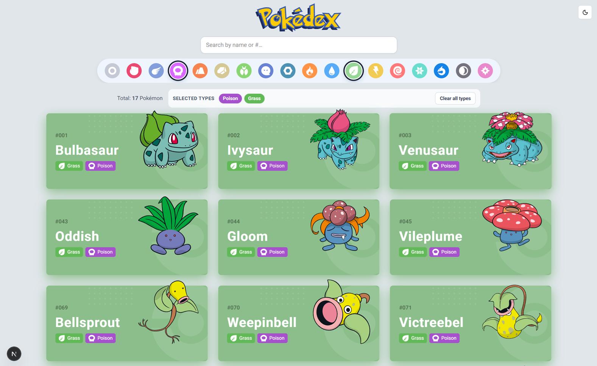
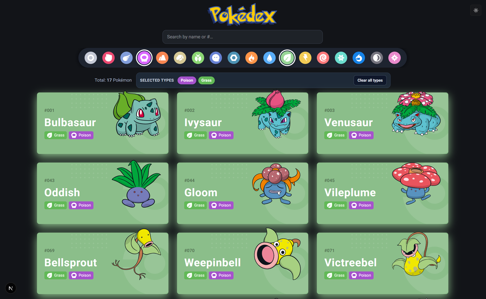
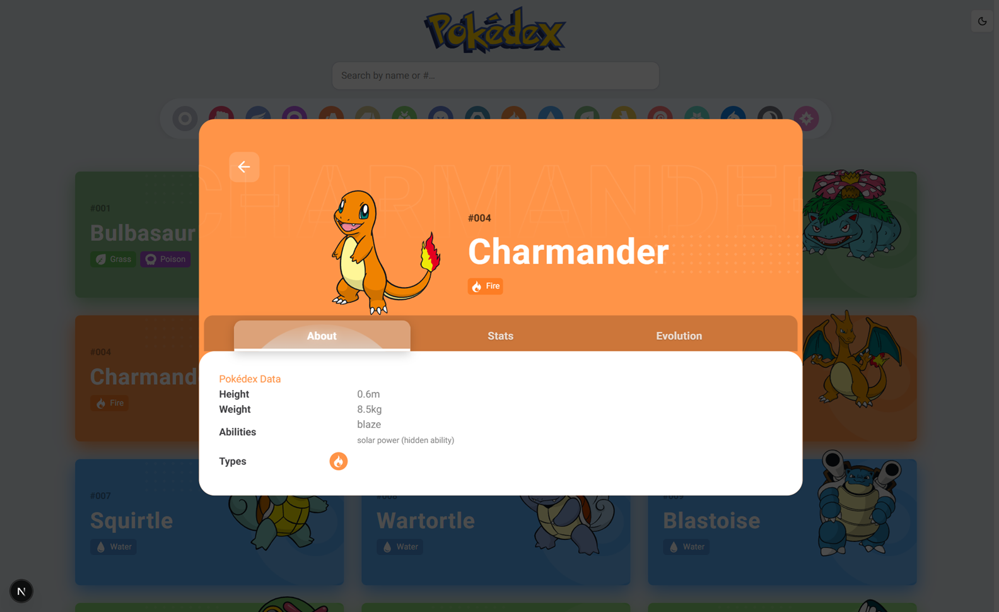
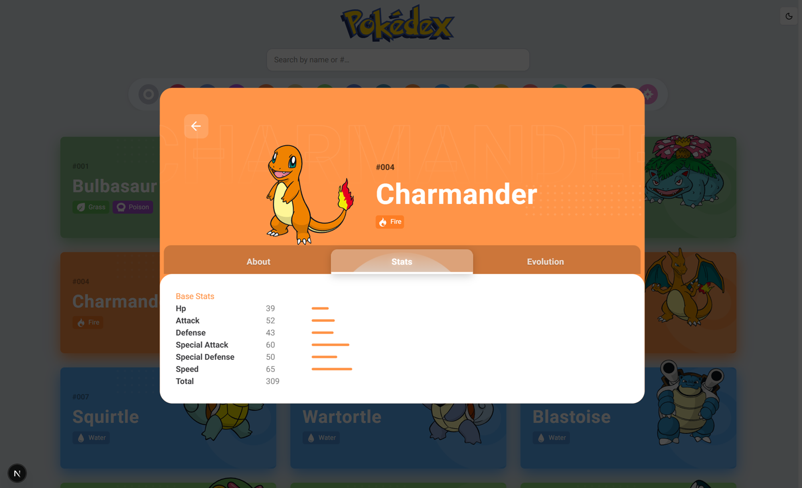
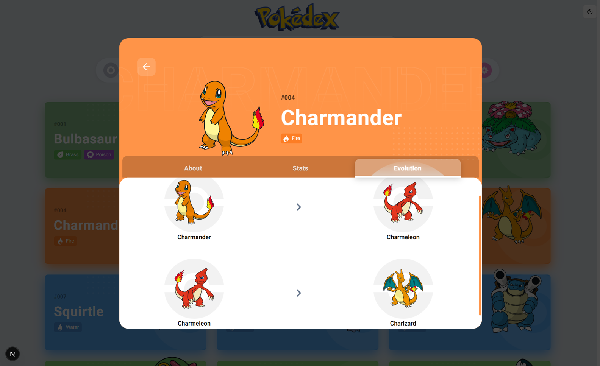

# pokeapi-nextjs

A **Pokédex** web app built with **Next.js 16** (App Router), **TypeScript**, **Tailwind CSS v4**, and **Radix UI**. It loads live data from [PokéAPI v2](https://pokeapi.co/docs/v2): **multi-select types** (AND filter, or none for the full dex), **search** (name / number), **paginated** grid, detail **Dialog** with **Tabs**, and **light / dark** theme with a circular reveal animation.

## Demo

|  |      |
| :--------------------------------------------------------------: | :---------------------------------------------------: |
|             |  |



## Features

- **Search** + **multi-type** filter (AND: every selected type; empty = all Pokémon), Radix **ToggleGroup** + **Tooltip**, paginated card grid, total + selected-type summary with clear action
- **TanStack Query** — `useSuspenseQuery` for types and catalog pages ([hooks/usePokemonsForTypes.ts](hooks/usePokemonsForTypes.ts) `usePokemonCatalogPage`: cached type refs or full index refs, full `/pokemon/{id}` only for the visible page)
- **Loading** — Radix Themes **Skeleton** grid fallback ([components/pokedex/PokemonCatalogSkeleton.tsx](components/pokedex/PokemonCatalogSkeleton.tsx))
- **Light / dark mode** — `next-themes` (system preference + manual toggle) with an animated switch: **View Transitions API** (`document.startViewTransition`) circular reveal when the browser supports it, **`clip-path`** transition fallback otherwise ([components/theme/ThemeToggle.tsx](components/theme/ThemeToggle.tsx), [components/theme/ThemeProvider.tsx](components/theme/ThemeProvider.tsx))
- Strict API and domain types (`lib/pokeapi`, `lib/pokemon`, `lib/pokedex`)
- Static artwork under `public/images` (Pokéball masks, type icons, demo shots)
- **Roboto** + **Pokémon Solid** (logo) in [app/layout.tsx](app/layout.tsx)

## Requirements

- Node.js **20+**
- **pnpm** `10.x` (see `packageManager` in [package.json](package.json))

## Getting started

```bash
pnpm install
pnpm dev
```

Open [http://localhost:3000](http://localhost:3000).

### Scripts

| Command      | Description                                                      |
| ------------ | ---------------------------------------------------------------- |
| `pnpm dev`   | Development server (Turbopack)                                   |
| `pnpm build` | Production build + typecheck                                     |
| `pnpm start` | Run production build locally                                     |
| `pnpm lint`  | `tsc --noEmit` + ESLint ([eslint.config.mjs](eslint.config.mjs)) |

### Optional environment

Set **`NEXT_PUBLIC_SITE_URL`** (no trailing slash) for [app/sitemap.ts](app/sitemap.ts) in production.

## Project layout

```
app/                      # App Router: layout, page, globals, pokedex.css
components/
  pokedex/                # PokedexRoot, toolbar, grid, dialog, tabs, context, skeleton
  theme/                  # ThemeProvider, ThemeToggle
  ui/                     # button, tooltip
hooks/                    # useTypes, usePokemonsForTypes (catalog page), useEvolution
lib/
  pokeapi/                # HTTP client + API types
  pokemon/                # formatters (stats, evolution, sprites)
  pokedex/                # type refs, per-page Pokémon fetch, typeLabel helper
public/images/            # SVGs, type icons, demo/*.png screenshots
docs/                     # pokedex.md, pokedex-plan.md
AGENTS.md                 # Agent / contributor conventions
```

## Agent / contributor notes

See **[AGENTS.md](AGENTS.md)** for architecture, lint/build, PR conventions, and UX invariants.
