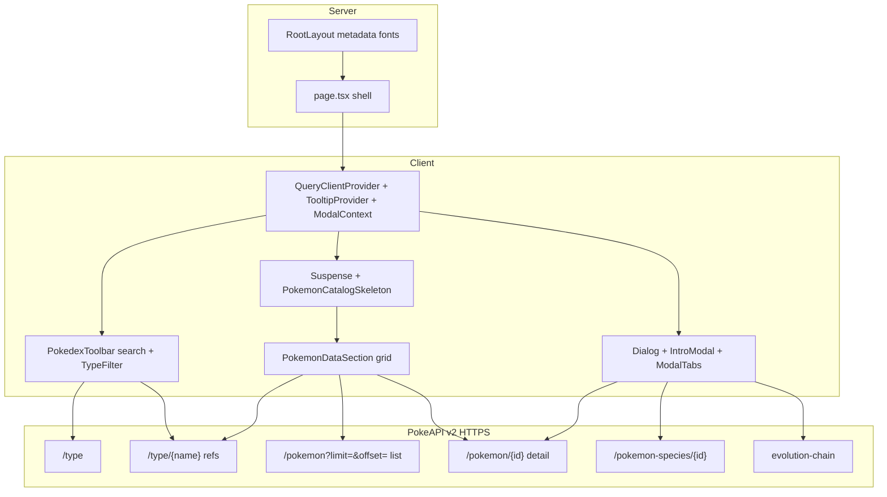

# Pokédex Next.js implementation plan

Living plan aligned with the repo. The durable feature spec lives in [docs/pokedex-plan.md](docs/pokedex-plan.md).

## Goals and constraints

- **Visual parity:** Match layout, typography, colors, spacing, hover states, loaders, modal open/close animations, card chrome, evolution arrows, and responsive breakpoints in [app/pokedex.css](app/pokedex.css) and [components/pokedex/](components/pokedex/) (wrapper, logo, types bar + wrap, grid, modal intro + tabs, data panels).
- **APIs:** [PokéAPI v2](https://pokeapi.co/docs/v2):
  - **`GET /type`** — build the type filter list (exclude **`unknown`**, **`shadow`**, **`stellar`** in [hooks/useTypes.ts](hooks/useTypes.ts)).
  - **`GET /type/{name}`** — Pokémon **refs** only (name/url); used for type-filtered lists and **intersection (AND)** when multiple types are selected ([lib/pokedex/pokemonRefs.ts](lib/pokedex/pokemonRefs.ts)).
  - **`GET /pokemon?limit=1&offset=0`** then **`GET /pokemon?limit={count}&offset=0`** — full national index as refs when **no types** are selected (`fetchAllPokemonRefsFromIndex`).
  - **`GET /pokemon/{id}`** — full card / modal payload, **only for the current catalog page** (batched), via [lib/pokedex/fetchPokemonFormatted.ts](lib/pokedex/fetchPokemonFormatted.ts).
  - **`GET /pokemon-species/{id}`** + evolution chain URL for evolution tab. Image fallbacks and evolution helpers in [lib/pokemon/format.ts](lib/pokemon/format.ts).
- **Theme:** [components/theme/ThemeToggle.tsx](components/theme/ThemeToggle.tsx) — **View Transitions API** when supported, **`clip-path`** fallback; rules also in [app/globals.css](app/globals.css). [components/theme/ThemeProvider.tsx](components/theme/ThemeProvider.tsx) + `next-themes` wired from [app/layout.tsx](app/layout.tsx).
- **Radix + Tailwind:** Primitives plus Tailwind; **keep Pokédex class names** that drive CSS (`types-bar`, `types-bar__scroller`, `pokemon-card`, `modal`, `overlay`, `data-container`, `modal-scroll-panel`, `pokedex-catalog-meta`, etc.):
  - **Dialog:** [components/pokedex/PokemonDialog.tsx](components/pokedex/PokemonDialog.tsx) — `overlay` / `modal` classes; overlay/modal **z-index** above the page; tooltips use higher z-index on content ([components/ui/tooltip.tsx](components/ui/tooltip.tsx)).
  - **Tabs:** [components/pokedex/ModalTabs.tsx](components/pokedex/ModalTabs.tsx) — tab rail + `data-state="active"` styles.
  - **Type filter:** `@radix-ui/react-toggle-group` ([components/pokedex/TypeFilter.tsx](components/pokedex/TypeFilter.tsx)); **empty selection allowed** (show all Pokémon). Active ring via **`.types-bar__item--active`** (Tooltip trigger overwrites toggle `data-state`). Outer `.types-bar` + inner `.types-bar__scroller` avoid clipping the ring; **Tooltip** on each chip and on modal type badges ([IntroModal.tsx](components/pokedex/IntroModal.tsx), [AboutTab.tsx](components/pokedex/tabs/AboutTab.tsx)).
  - **Search:** Radix **Label** ([components/pokedex/PokemonSearch.tsx](components/pokedex/PokemonSearch.tsx)); filter uses **`useDeferredValue`** on the catalog query string.
  - **Pagination:** Radix **Toolbar** ([components/pokedex/Pagination.tsx](components/pokedex/Pagination.tsx)).
  - **Loading:** [components/pokedex/PokemonCatalogSkeleton.tsx](components/pokedex/PokemonCatalogSkeleton.tsx) — **`@radix-ui/themes`** `Theme` + **`Skeleton`** for the main grid Suspense fallback.
  - **Buttons:** [components/ui/button.tsx](components/ui/button.tsx) uses **Slot** where applicable.
- **Client boundary:** [components/pokedex/PokedexRoot.tsx](components/pokedex/PokedexRoot.tsx) — `QueryClientProvider`, **TooltipProvider**, modal context, toolbar, **Suspense** + skeleton, grid, dialog. Default **`selectedTypes: []`** (no filter = full dex). **Clear all types** resets to `[]`.
- **Data:** `@tanstack/react-query` — [hooks/useTypes.ts](hooks/useTypes.ts), [hooks/usePokemonsForTypes.ts](hooks/usePokemonsForTypes.ts) (`usePokemonCatalogPage`: cached ref lists, per-page detail fetch), [hooks/useEvolution.ts](hooks/useEvolution.ts). HTTP from the browser via [lib/pokeapi/client.ts](lib/pokeapi/client.ts).
- **TypeScript:** [lib/pokeapi/types.ts](lib/pokeapi/types.ts), [lib/pokemon/format.ts](lib/pokemon/format.ts); avoid `any`.
- **Assets:** [public/images](public/images) — pokeballs, `types-icons/*.svg`, optional **[public/images/demo/](public/images/demo/)** screenshots for [README.md](../README.md).
- **Fonts:** Roboto (`next/font/google`) + Pokémon Solid (CDN in [app/layout.tsx](app/layout.tsx)).
- **Images:** [next.config.js](next.config.js) `images.remotePatterns` where needed; `` acceptable for SVGs and predictable layout.

## High-level architecture

## Testing / quality bar

- **`pnpm lint`** and **`pnpm build`** pass.
- **Spot-check:** With **no types** selected, grid shows a page of the full dex; selecting **two types** shows only Pokémon with **both** types; **Clear all types** returns to the full list; type bar scrolls to every icon; **active** type chips show the ring; opening a card shows modal with primary-type class on `.modal`; tabs (About / Stats / Evolution) work; dialog overlay/back/escape behave; **tooltips** work on type chips (toolbar, intro header, About types row); **theme toggle** runs circular reveal (or fallback) without layout flash.
