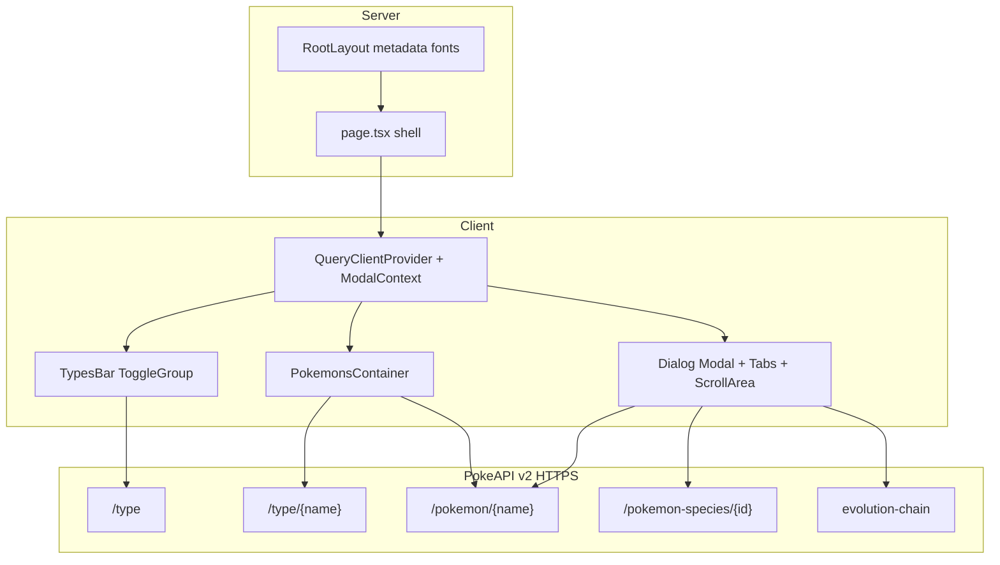

# Pokédex Next.js implementation

## Documentation deliverable

After you confirm this plan, the first implementation step is to create [docs/pokedex.md](docs/pokedex.md) (under `docs/`) containing this specification verbatim so the repo holds the plan next to the code. Cursor’s plan UI is the working copy; `docs/pokedex.md` is the durable project spec.

## Goals and constraints

- **Visual parity:** Match layout, typography, colors, spacing, hover states, loader, modal open/close animations, card chrome, evolution arrows, and responsive breakpoints defined in [app/pokedex.css](app/pokedex.css) and the component structure under [components/pokedex/](components/pokedex/) (wrapper, logo, types bar, grid, modal intro + tabs + white data panel).
- **APIs:** Use [PokeAPI v2](https://pokeapi.co/docs/v2): `GET /api/v2/type` (filter `unknown` / `shadow`), `GET /api/v2/type/{name}` for members, `GET /api/v2/pokemon/{name}` for cards/detail, `GET /api/v2/pokemon-species/{id}` plus the evolution chain URL for evolution data. Image fallbacks and evolution sprite rules live in [lib/pokemon/format.ts](lib/pokemon/format.ts) (`formatPokemonData`, `normalizeEvolutionChain`, and related helpers).
- **Theme animation:** Preserve the behavior in [app/components/ThemeToggle.tsx](app/components/ThemeToggle.tsx) (View Transitions when supported, clip-path fallback) and the related `@supports (view-transition-name: root)` rules in [app/globals.css](app/globals.css). Keep `next-themes` + `ThemeProvider` in [app/layout.tsx](app/layout.tsx).
- **Radix + Tailwind:** Build interactive UI with Radix primitives and Tailwind utilities while **keeping the Pokédex class names and structure** where they drive styling (e.g. `types-bar`, `pokemon-card`, `modal`, `overlay`, `data-container`, `evolution-container`). Concretely:
  - **Modal shell:** `@radix-ui/react-dialog` in [components/pokedex/PokemonDialog.tsx](components/pokedex/PokemonDialog.tsx); map `Dialog.Overlay` / `Dialog.Content` to the `overlay` / `modal` classes and `data-content` / `data-state` hooks used by the CSS animations.
  - **Tabs:** `@radix-ui/react-tabs` in [components/pokedex/ModalTabs.tsx](components/pokedex/ModalTabs.tsx), styled to match `.modal nav button` and the active pokeball mask (`data-state="active"`).
  - **Type filter:** `@radix-ui/react-toggle-group` for the circular type icons (keyboard-accessible), styled like the original pill bar.
  - **Scrollable panel:** `@radix-ui/react-scroll-area` in [components/ui/scroll-area.tsx](components/ui/scroll-area.tsx), wrapping content that uses `data-container` / `data-container--radix` classes.
  - **Buttons / icons:** [components/ui/button.tsx](components/ui/button.tsx) for `ThemeToggle`; use Radix-backed primitives elsewhere (`Slot`, etc.).
- **Performance / RSC vs client:** Default selected type is **`ice`** (see [components/pokedex/PokedexRoot.tsx](components/pokedex/PokedexRoot.tsx)). Modal open/close stays client-side. Split roughly as:
  - **Server:** [app/layout.tsx](app/layout.tsx) metadata, fonts, global styles.
  - **Client boundary:** `PokedexRoot` wraps `QueryClientProvider`, modal context, types bar, grid, and dialog.
  - **Data:** `@tanstack/react-query` in [hooks/useTypes.ts](hooks/useTypes.ts), [hooks/usePokemons.ts](hooks/usePokemons.ts), [hooks/useEvolution.ts](hooks/useEvolution.ts) with typed `queryFn`s and stable `queryKey`s. Fetches go to `https://pokeapi.co/api/v2/...` from the client via [lib/pokeapi/client.ts](lib/pokeapi/client.ts); server-side fetch with `next: { revalidate }` is optional if logic moves to RSC later.
- **TypeScript:** Hand-written minimal API types in [lib/pokeapi/types.ts](lib/pokeapi/types.ts), domain types (`FormattedPokemon`, evolution pairs) in [lib/pokemon/format.ts](lib/pokemon/format.ts). Avoid `any`; use `unknown` + guards only when the payload is genuinely open-ended.
- **Assets:** Static artwork under [public/images](public/images) (`pokeball.svg`, `pokeball-transparent.svg`, `types-icons/*.svg`) so CSS `mask` / `url()` paths match `/images/...`.
- **Fonts:** **Roboto** via `next/font/google` and **Pokemon Solid** via the CDN stylesheet linked in [app/layout.tsx](app/layout.tsx); body uses the Roboto class stack.
- **Images:** `next/image` where helpful, with `images.remotePatterns` in [next.config.js](next.config.js) (e.g. `raw.githubusercontent.com` for sprites). Prefer plain `` for SVG or fragile URLs so layout stays predictable.
- **Styles:** Pokédex-specific rules live in [app/pokedex.css](app/pokedex.css) (keyframes `unfoldIn`, `unfoldOut`, `pulse`, `shake`, `blur`, `fill`). Dark companions use `html.dark` scoped rules. Shared theme and view-transition rules stay in [app/globals.css](app/globals.css).
- **Housekeeping:** [package.json](package.json) name/scripts, [app/layout.tsx](app/layout.tsx) metadata/JSON-LD, [app/sitemap.ts](app/sitemap.ts), and [next.config.js](next.config.js) stay aligned with deployment and image hosts.
- **Code shape:** `lib/pokeapi/client.ts`, `lib/pokeapi/types.ts`, `lib/pokemon/format.ts`, and `components/pokedex/*`. Avoid duplicating fetch/format logic between the grid and the modal.

## High-level architecture

## Testing / quality bar

- `pnpm lint` and `pnpm build` pass.
- Spot-check: default **Ice** type loads, switching types updates the grid, opening a card shows the modal with the correct primary-type color class, tabs cycle About / Stats / Evolution, overlay/back/close behave like Radix Dialog, and the theme toggle animation still runs.
